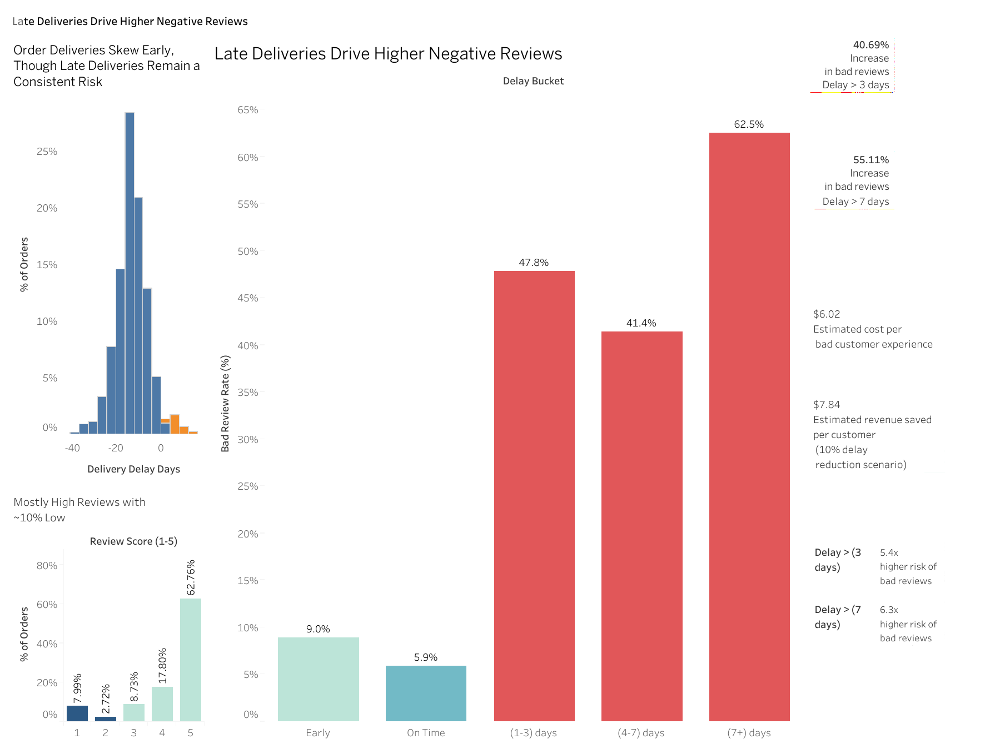

## Problem
Delivery delays may harm customer experience, but how large is the effect?

## Approach
- Feature engineering (customer history, delay metrics)
- Observational + causal analysis (AIPW)
- Tableau dashboard for communication

## Key Results
- +40pp increase in bad reviews (delay > 3 days)
- +56pp increase (delay > 7 days)
- 5–6x higher risk of negative experience
- ~$6 revenue impact per bad experience

## Dashboard
[Insert screenshot]

Delivery delays have a substantial and causal impact on customer experience. Orders delayed by more than 3 days increase the likelihood of a negative review by approximately 40 percentage points, rising to over 55 percentage points for delays exceeding 7 days. In relative terms, this corresponds to a 5–6x increase in risk.

Even small delays (1–3 days) dramatically increase dissatisfaction, indicating that maintaining on-time delivery is critical. Based on average order value, each negative experience represents an estimated $6 in lost value, suggesting meaningful revenue at risk at scale.

Operational efforts should prioritize reducing delays beyond the estimated delivery date, particularly focusing on shipments at risk of exceeding 3 days late.

## Dashboard

